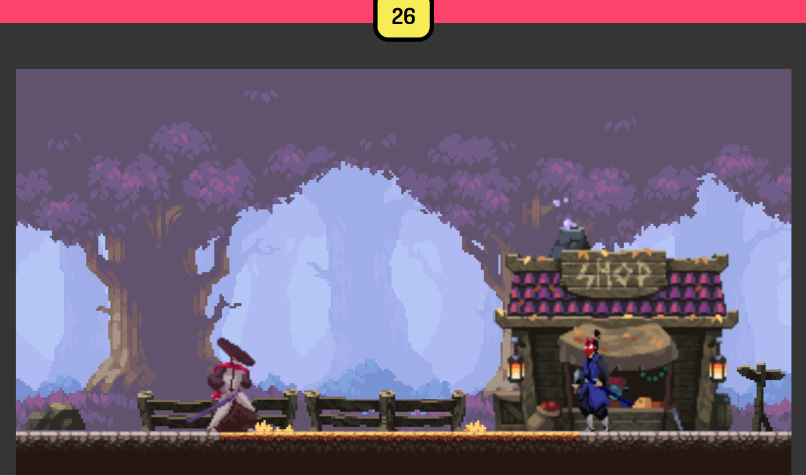

<h1 align="center">mura</h1>
<p align="center" style="font-size:16px"><strong>2D Fighting Game</strong></p>
<p align="center">  
  
</p>

<p align="center">
  
  
  
  
  
</p>

<div align="center"><a href="https://mura.vercel.app/" target="_blank">Live Demo</a></div>

## Tech Stack


## Screenshots



## Quick Start

Follow these steps to set up the project locally on your machine.

**Prerequisites**

Make sure you have the following installed or downloaded on your machine:

- [Git](https://git-scm.com/)
- [Node.js](https://nodejs.org/en)

**Cloning the Repository**

```bash
git clone https://github.com/yuran1811/mura.git
cd mura
```

**Installation**

Install the project dependencies:

```bash
npm install
```

or

```bash
yarn
```

**Running the Project**

```bash
npm run dev
```

or

```bash
yarn dev
```

Open [http://localhost:5173](http://localhost:5173) in your browser to view the project.

## References

- **Special thanks to [Chris Course](https://www.youtube.com/watch?v=vyqbNFMDRGQ)**
